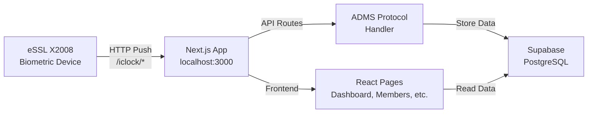

# GymTrack — Attendance Management System Walkthrough

## ✅ Build Status: Successful

The entire application has been built and verified:
- **TypeScript compilation**: ✅ Pass
- **All pages rendering**: ✅ Pass  
- **ADMS API routes**: ✅ Active
- **Dev server**: Running at `http://localhost:3000`

---

## Pages Overview

### Dashboard


- **6 stat cards** with glassmorphism: Total Members, Present, Absent, Late, Devices Online/Offline
- **Weekly attendance trend chart** (Area chart with gradient fills)
- **Real-time activity feed** showing latest check-ins/outs with verification method icons
- **Connected devices table** showing X2008 status

---

### Members Management


- Full member list with search & status filter
- Shows verification method icons (Face, Fingerprint, Card)
- Add Member modal with form fields
- Edit/Delete actions per member

---

### Device Management


- Device detail card showing all X2008 info (serial, MAC, firmware, algorithms)
- Quick command buttons (Check Status, Device Info, Restart, Clear Logs)
- Custom command input
- Command history with execution status

---

### App Demo Recording


---

## Architecture



## ADMS Push Protocol Endpoints

| Endpoint | Method | Purpose |
|---|---|---|
| `/api/iclock/cdata` | GET | Device handshake — returns registry options |
| `/api/iclock/cdata` | POST | Receives ATTLOG (attendance) and OPERLOG (operations) |
| `/api/iclock/ping` | GET | Device heartbeat — updates last_ping |
| `/api/iclock/getrequest` | GET | Device polls for pending commands |
| `/api/iclock/devicecmd` | POST | Device reports command execution results |

> [!NOTE]
> URL rewrites in `next.config.ts` map `/iclock/*` → `/api/iclock/*` for device compatibility.

## File Structure

```
gym-attendance/
├── src/
│   ├── app/
│   │   ├── api/iclock/
│   │   │   ├── cdata/route.ts        ← Attendance data receiver
│   │   │   ├── ping/route.ts         ← Device heartbeat
│   │   │   ├── getrequest/route.ts   ← Command polling
│   │   │   └── devicecmd/route.ts    ← Command results
│   │   ├── attendance/page.tsx       ← Attendance logs + daily summary
│   │   ├── devices/page.tsx          ← Device management + commands
│   │   ├── import/page.tsx           ← CSV/Excel import
│   │   ├── members/page.tsx          ← Member management
│   │   ├── reports/page.tsx          ← Charts & reports
│   │   ├── globals.css               ← Dark theme design system
│   │   ├── layout.tsx                ← Root layout with sidebar
│   │   └── page.tsx                  ← Dashboard
│   ├── components/
│   │   ├── Header.tsx
│   │   ├── Sidebar.tsx
│   │   └── StatCard.tsx
│   └── lib/
│       ├── adms-parser.ts            ← ADMS protocol data parser
│       ├── supabase.ts               ← Supabase client
│       ├── types.ts                  ← TypeScript types
│       └── utils.ts                  ← Shared utilities
├── .env.local                        ← Supabase credentials
└── next.config.ts                    ← ADMS URL rewrites
```

## Next Steps to Connect Your Device

> [!IMPORTANT]
> To receive live data from your eSSL X2008 device, follow these steps:

### 1. Add Supabase Credentials
Edit [.env.local](file:///c:/Users/aroma/Desktop/ssl/gym-attendance/.env.local) with your actual Supabase project URL and keys.

### 2. Create Database Tables
Run the SQL migration in your Supabase dashboard to create: `devices`, `members`, `attendance_logs`, `device_commands`, `device_op_logs`.

### 3. Configure Device
On the eSSL X2008 device:
1. Go to **Comm. → Cloud Server Setting**
2. Set **Server Address** to `http://192.168.1.5` (your PC's IP)
3. Set **Server Port** to `3000`
4. Enable **ADMS** mode
5. Restart the device

### 4. Verify Connection
Once configured, the device will start pinging `http://192.168.1.5:3000/iclock/ping?SN=NYU7260400977` and pushing attendance data automatically.
